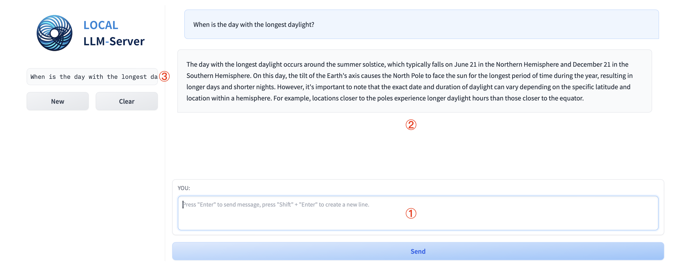

# Local LLM Server

## Overview
[**LOCAL-LLM-SERVER (LLS)**](https://github.com/Xiaohan-Tian/local-llm-server) is an application that can run open-source LLM models on your local machine. It provides you an OpenAI-Compatible completation API, along with a command-line based Chatbot Interface, as well as an optional Gradio-based Web Interface that allows you to share with others easily.

The template-based configurations allow you to easily configure prompt template for different models. This application is based on [**llama.cpp**](https://github.com/ggerganov/llama.cpp) which provides you great performance with multiple machine learning acceleration methods such as NVIDIA CUDA and Apple Metal Framework.

We provide you pre-compiled version of Windows with CUDA devices, Windows with CPU only, and macOS with Apple Silicon. You can find them on the [**Release Page**](https://github.com/Xiaohan-Tian/local-llm-server/releases) and directly download them into your local machine and start to use it with zero configuration.

### Features:
- Run open-source LLMs on your local machine with OpenAI-compatible chat completation API.
- Supports inference with CPU-only, CUDA and Apple Silicon.
- Built-in Command-line based chatbot which can be easily used even in a terminal-only environment.
- Built-in Gradio based Web UI allow you easily interact with the model and also can be easily shared with others over the network.
- Template-based configuration allows you to easily setup prompt template for new LLM models.

## Quick Start

### Start LLS on Windows:

Please download the latest build for Windows from the [**Release Page**](https://github.com/Xiaohan-Tian/local-llm-server/releases), we provide you two versions:
- CUDA version (require NVIDIA Driver with CUDA >= 12.2 installed): `LLS-win-x64-cuda-{version}.zip`. If you want to check the CUDA version, please refer to the "Common Questions" section of this page.
- CPU version: `LLS-win-x64-{version}.zip`.
- Note: we plan to support AMD ROCm in the future releases, right now it is possible to use ROCm if you install from the source code, please see "Installation (From the source code)" section for more details.

Once you downloaded the zip file, please unzip it into an empty folder, double click the `LLS.exe` icon will start the application.

### Start LLS on macOS:

Please download the latest build for macOS from the [**Release Page**](https://github.com/Xiaohan-Tian/local-llm-server/releases): `LLS-darwin-arm64-{version}.zip`. Please note this build is for macOS running on Apple Silicons (M1/M2/M3/...), if you are using a Mac with Intel CPU, please see "Installation (From the source code)" section for more details.

Once you downloaded the zip file, please unzip it into an empty folder, open the `Terminal` app in macOS and type the following command (assume you unzipped into folder `/path/to/your/unzipped/folder`):
```bash
cd /path/to/your/unzipped/folder
./LLS
```

Note for newer version of macOS, you may encounter a pop-up message indicates "macOS cannot verify that this app is free from malware" due to the pre-build version doesn't using an Apple Developer Indentifier, you can either install from the source code or execute the following command to bypass this message box:
```bash
cd /path/to/your/unzipped/folder
xattr -d com.apple.quarantine ./* -r
```

### Using LOCAL-LLM-SERVER (LLS):

For the first time you run the LLS, the application will automatically download the model `mistral` from Huggingface, the exact model it downloads is `mistral-7b-instruct-v0.2.Q5_K_M.gguf` from `TheBloke/Mistral-7B-Instruct-v0.2-GGUF`. The `gguf` is a model format [**llama.cpp**](https://github.com/ggerganov/llama.cpp) is using and the `Q5_K_M` is the quantization method this model is using. If you are using the CUDA version of the LLS, please make sure you have at least 8GB VRAM. You can switch to another model using the chatbot command line once the app is started (see "Chatbot Commands" section), or by modifying the configuration file (see the "Configuration" section).

Once the app is finished loading the model, you will see the following content in your console:
```
=== ===  === ===  === ===		 SERVER STARTED 		=== ===  === ===  === ===
Running on local URL:  http://127.0.0.1:7860

To create a public link, set `share=True` in `launch()`.
=== ===  === ===  === ===		 GUI STARTED 		=== ===  === ===  === ===
- Enter your message after the ">>>", then press "Return/Enter" to start a new line.
- Type "/chat" or "/" to send the current message to the language model (LLM).
- Type "/quit" or "/q" to exit the application.
- Type "/clear" or "/c" to clear the chat history.
- Type "/load {model_name}" to load a model by its name, ensuring the configuration file "./llm_config/{model_name}.yaml" exists.
- Type "/pull {huggingface_id}/{huggingface_file}" as {model_name} from {base_model_name} to download a model from HuggingFace. Ensure the configuration file 
"./llm_config/{base_model_name}.yaml" exists; a new configuration file "./llm_config/{model_name}.yaml" will be automatically created. Example: "/pull 
microsoft/Phi-3-mini-4k-instruct-gguf/Phi-3-mini-4k-instruct-q4.gguf as phi3 from phi2".
- Type "/language {language_tag}" to switch to a specified language. Remember to restart the app for the new language settings to take effect.

──────────────────────────────────────────────────────────────────────────────────────────────────────────────────────────────────────────────────────────────────────────────────────────
YOU: 


>>> 
```
If you are using Windows or macOS, your default browser will automatically be opened (or a new tab will be created) with URL `http://127.0.0.1:7860`, this is the homepage of the LLS Web UI:



- You can type your message in the input box at ①, press `Enter/Return` or press the `Send` button below to send the message.
- Your chat history with the language model will be shown in the main area at ②
- If you have more than one chat sessions, they will be listed on at ③, you can switch between different sessions by clicking different items on the list. Click the "New" button below will start a new chat session, click "Clear" button will remove current chat session.

You can also chat or input commands in the terminal window, please see the on-screen instructions for available commands.

## Installation (From the source code)

### Prerequisites
- Python >= 3.9.16
- `pip` package manager

### Steps
1. **Install [**llama-cpp-python**](https://github.com/abetlen/llama-cpp-python):**

    We are only listing the essential steps for install [**llama-cpp-python**](https://github.com/abetlen/llama-cpp-python), for detailed steps including how to enable ROCm for AMD GPUs, please see the [**Project Homepage**](https://github.com/abetlen/llama-cpp-python).
    
    a. Linux with CUDA enabled
    ```bash
    CMAKE_ARGS="-DLLAMA_CUBLAS=on" FORCE_CMAKE=1 pip install llama-cpp-python==0.2.74 --force-reinstall --upgrade --no-cache-dir --verbose
    ```
    b. macOS with Metal enabled
    - Make sure you have XCode installed (Please install the full version via AppStore, not only the command-line tools)
    - check the path of your XCode installation
    ```bash
    xcode-select -p
    ```
    it suppose to return `/Applications/Xcode-beta.app/Contents/Developer`. If it returns you the command-line tools' path, please make sure you installed the full version of the XCode via the AppStore.
    - Install `conda` via miniforge3:
    ```bash
    curl -L -O "https://github.com/conda-forge/miniforge/releases/latest/download/Miniforge3-$(uname)-$(uname -m).sh"
    bash Miniforge3-$(uname)-$(uname -m).sh
    ```
    - Install [**llama-cpp-python**](https://github.com/abetlen/llama-cpp-python) for Intel CPU based macOS:
    ```bash
    pip uninstall llama-cpp-python -y
    CMAKE_ARGS="-DLLAMA_METAL=on" pip install -U llama-cpp-python==0.2.74 --no-cache-dir
    ```
    - Install [**llama-cpp-python**](https://github.com/abetlen/llama-cpp-python) for Apple Silicon based macOS:
    ```bash
    pip uninstall llama-cpp-python==0.2.74 -y
    CMAKE_ARGS="-DLLAMA_METAL_EMBED_LIBRARY=ON -DLLAMA_METAL=on" pip install -U llama-cpp-python --no-cache-dir
    ```
    c. Windows with CUDA enabled
    - Install [**Visual Studio Community Edition**](https://visualstudio.microsoft.com/vs/community/).
    - Install [**CUDA Toolkits**](https://developer.nvidia.com/cuda-downloads), please make sure the CUDA Toolkits version you are trying to install can match the CUDA version display in the `nvidia-smi` command's result, or just let the CUDA Toolkits installer to override your existing NVIDIA driver (check all the driver components when installing CUDA Toolkits).
    - Install [**llama-cpp-python**](https://github.com/abetlen/llama-cpp-python):
    ```
    set CMAKE_ARGS=-DLLAMA_CUBLAS=on
    set FORCE_CMAKE=1

    echo %CMAKE_ARGS%
    echo %FORCE_CMAKE%

    pip install llama-cpp-python==0.2.74 --force-reinstall --upgrade --no-cache-dir --verbose
    ```

2. **Install Other Dependencies:**
    ```bash
    pip install -r requirements.txt
    ```

## Usage

### Starting the Server
1. **For Yourself, Only Use LLS on Local Environment:**
    ```bash
    python ./app.py
    ```

2. **Using Gunicorn (Recommended for production):**
    ```bash
    gunicorn --worker-class gthread --threads 4 --bind 0.0.0.0:8000 'app:start_server()'
    ```
    Notes: 
    - Please make sure to use thread-based works to avoid multiple `llama.cpp` instances running on the GPU. 
    - The CLI Chatbot and the GUI won't be available when you are using `gunicorn`.

### Making Requests
The server uses the same request and response format as the OpenAI completion API. Here's an example using `curl`:
1. **Linux**
```bash
curl -X POST \
  -H "Content-Type: application/json" \
  -H "User-Agent: insomnia/8.6.1" \
  -d '{
        "messages": [
            {
                "role": "user",
                "content": "When is the day with the longest daylight of the year?"
            }
        ]
      }' \
  "http://localhost:8000/v1/chat/completions"
```

2. **Windows** (Require Windows 10/11 or install [**cURL for Windows**](https://curl.se/windows/))
```
curl -X POST -H "Content-Type: application/json" -H "User-Agent: insomnia/8.6.1" -d "{\"messages\": [{\"role\": \"user\", \"content\": \"When is the day with the longest daylight of the year?\"}]}" "http://localhost:8000/v1/chat/completions"
```

## Configuration
The server can be configured using environment variables and a YAML configuration file. Refer to the `config` directory for example configurations.

## Common Questions
### How to check installed CUDA version?
Please open a command line window in Windows 10/11 or in the terminal of Linux distributions, run the following command:
```
nvidia-smi
```
You will see a table list your GPU and driver's information. On the top-right corner, it will display the current CUDA version.

## License
This project is licensed under the MIT License. See the `LICENSE` file for details.

